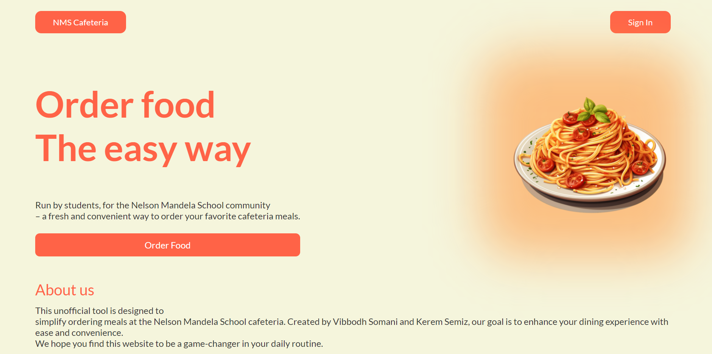

# 🍽️ NMS Cafeteria Website

This project is a user-friendly, visually appealing website for the **Nelson Mandela School Cafeteria**. The site is designed with a warm color theme to enhance the user experience, allowing students and staff to order meals with ease.

Live website deployment: https://keremsemiz.github.io/fix-website/pages/

## 🌟 Features

- 🛍️ **Easy Food Ordering**: Simplifies the process of ordering meals at the school cafeteria.
- 💻 **Responsive Design**: Works seamlessly on both desktop and mobile devices.
- 🎨 **Warm Color Theme**: Provides a visually appealing and welcoming experience.
- 📋 **About Us Section**: Includes a brief introduction about the site and its purpose.

## 🔧 Built With

- **HTML5**: The structure and layout of the website.
- **CSS3**: Used for styling, creating a responsive and warm design.
- **JavaScript**: Handles dynamic functionalities (if applicable).

## 📂 Project Structure

- **`.anima/`**: Contains animation or interactive design elements.
- **`assets/`**: Contains images, icons, and other media files.
- **`pages/`**: Additional sections or pages of the website (e.g., about page).

## 🚀 Deployment
- This Website was deployed with Github Pages, you can access it right here: [Live Website](https://keremsemiz.github.io/fix-website/pages)

